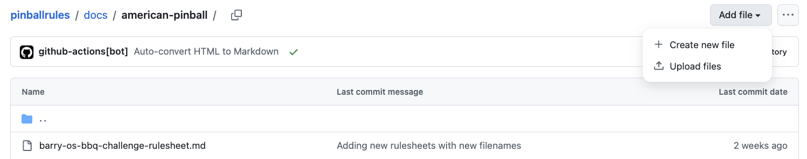
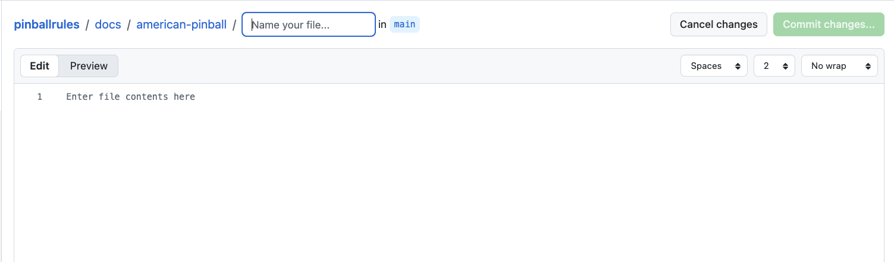
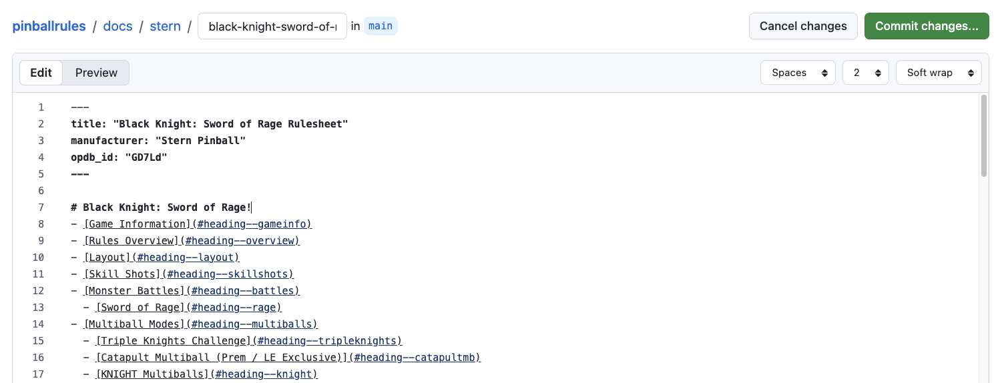
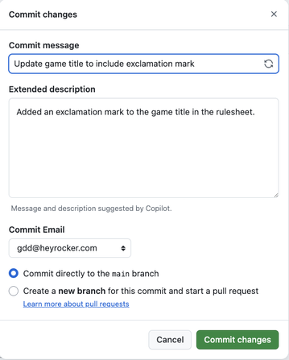

The rulesheets on this site are edited in your browser here on Github. Github was designed for coding projects, but it works well for files in any text format. To familiarize yourself with where they live and how they are organized, please see [How the rulesheets are organized](organize). This will help you find the rulesheet you want to edit.

To create a rulesheet, navigate to the appropriate manufacturer's directory and click "Add file..." at the top right, then "Create new file".

THis will take you to Github's editor interface where you can create your rulesheet.

The first thing you will need to do is name your rulesheet, although what you are actually doing is naming the file the rulesheet will be stored in. The standard for rulesheet file names is that each word in the title is separated by hyphens, and given an extension of ".md". For instance World Cup Soccer becomes world-cup-soccer.md. 

The rule sheets are written in [Markdown](https://github.com/adam-p/markdown-here/wiki/markdown-cheatsheet), which allows you to do formatting using plain text. The previous Tilt Forums rulesheets also used Markdown, although they had a more complete editor to help with it. Name your rulesheet, make whatever changes are necessary, and then click the "Commit changes..." button at the top right.

Once you do that you will get the following dialog

Github will automatically create a commit message, feel free to use that or add one of your own. Then just click "Commit Changes" again and you're done! Your edits will be reflected on the site in a few minutes.