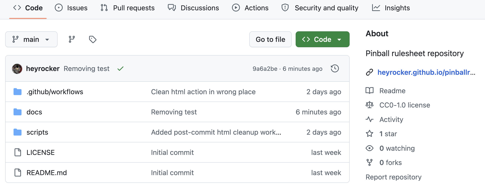
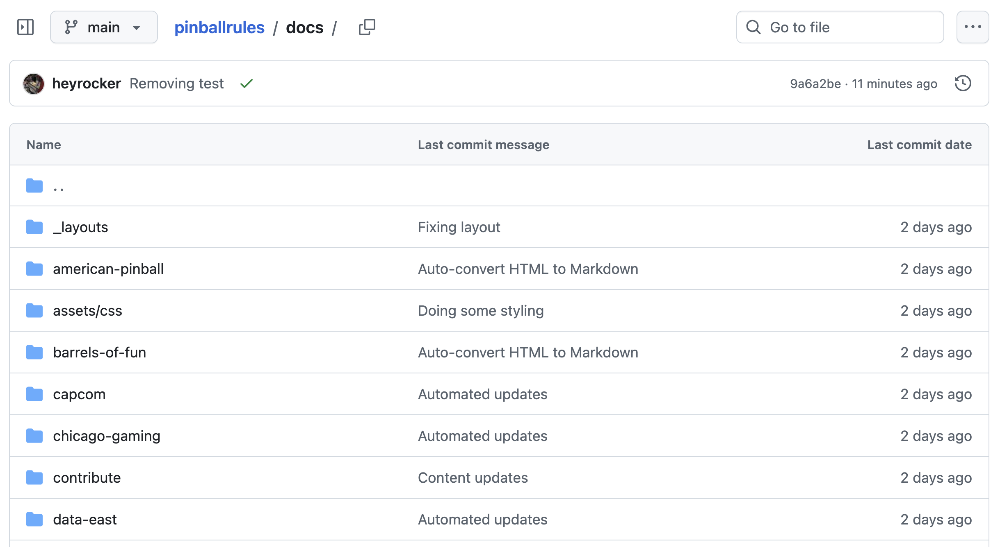

The rulesheets on this site are edited in your browser here on Github. Github was designed for coding projects, but it works well for files in any text format. The files are stored in repositories. To start, go to [the homepage for the pinball rules repository.](https://github.com/heyrocker/pinballrules)

There are several tabs across the top, plus a listing of all the files and directories on the site. This is where we'll concentrate right now. One of the directories is named "docs" which is where the rulesheets are held. Click that and you will get a listing like this.

The rulesheets are divided into folders, with each folder representing one of the pinball manufacturers. Clicking a folder will reveal the rulesheets.